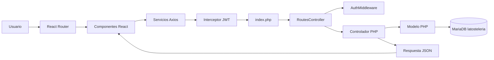

# La Tostelería

## Guía de ubicación de funcionalidades del proyecto

**Propósito:** servir como mapa mental técnico para ubicar rápidamente cada funcionalidad del sistema.

**Fecha de elaboración:** 25 de agosto de 2026  
**Arquitectura:** frontend React/Vite + API PHP + MariaDB/MySQL  
**Entorno previsto:** XAMPP en Windows

---

## 1. Mapa mental general

```text
LA TOSTELERÍA
|
|-- Frontend: appLaTosteleria/
|   |-- Arranque y navegación: src/main.jsx, src/App.jsx
|   |-- Diseño general: src/components/Layout/
|   |-- Seguridad de pantalla: src/components/User/Auth.jsx
|   |-- Sesión: src/context/UserContext.jsx
|   |-- Catálogo
|   |   |-- Productos: src/components/Producto/ + ProductService.js
|   |   |-- Combos: src/components/Combo/ + ComboService.js
|   |   |-- Menús por horario: src/components/Menu/ + MenuService.js
|   |-- Ventas y pedidos: src/components/Pedido/ + PedidoService.js
|   |-- Preparación: src/components/Procesos/ + ProcesosServices.js
|   |-- Administración: Dashboard/ y User/UserManagement.jsx
|   |-- Mapas y entrega: Leaflet + RouteService.js + UbicacionRepartidorService.js
|   |-- Estado compartido: CartContext.jsx, UserContext.jsx
|   `-- Traducciones y estilos: i18n.js, index.css, App.css
|
|-- Backend API PHP
|   |-- Entrada: index.php
|   |-- Ruteo y permisos: routes/RoutesController.php
|   |-- Autenticación: middleware/AuthMiddleware.php
|   |-- Lógica HTTP: controllers/*Controller.php
|   |-- Acceso a datos: models/*Model.php
|   `-- Infraestructura: controllers/core/
|
|-- Persistencia
|   `-- database/Script-BaseDatos-LaTosteleria.sql
|
`-- Archivos públicos
    |-- images/: imágenes usadas por el frontend
    `-- uploads/: archivos recibidos por la API
```

### Diagrama de comunicación



---

## 2. Cómo iniciar y entender el proyecto

### Backend

1. Iniciar Apache y MySQL desde XAMPP.
2. Crear la base de datos ejecutando `database/Script-BaseDatos-LaTosteleria.sql` en MariaDB/MySQL.
3. Verificar la conexión y configuración en `config.php` y `controllers/core/Config.php`.
4. La entrada de la API es `index.php`; las rutas se resuelven mediante `routes/RoutesController.php`.
5. Las dependencias PHP están en `vendor/` y se administran con Composer.

### Frontend

Desde `appLaTosteleria/`:

```powershell
npm install
npm run dev
```

Comandos útiles:

```powershell
npm run build
npm run lint
npm run prettier
```

El frontend necesita la variable `VITE_BASE_URL` en un archivo `.env` para apuntar a la API. Los servicios construyen sus URLs concatenando esa base con nombres como `producto`, `pedido` o `user`.

### Punto de entrada de React

`appLaTosteleria/src/main.jsx` registra:

- `UserProvider`, que mantiene el usuario a partir del JWT guardado en `localStorage`.
- `RouterProvider`, que define las pantallas y sus roles.
- Interceptores Axios, que agregan `Authorization: Bearer <token>` y redirigen al login ante un `401`.
- Notificaciones de `react-toastify`.

`appLaTosteleria/src/App.jsx` y `appLaTosteleria/src/components/Layout/Layout.jsx` forman la envoltura visual con encabezado, contenido y pie de página.

---

## 3. Mapa de funcionalidades

| Funcionalidad              | Pantallas frontend                                                                                                                 | Servicio                                                                             | Backend                                                                                                 | Tablas principales                                                  |
| -------------------------- | ---------------------------------------------------------------------------------------------------------------------------------- | ------------------------------------------------------------------------------------ | ------------------------------------------------------------------------------------------------------- | ------------------------------------------------------------------- |
| Inicio y catálogo público  | `Home/Home.jsx`, `Producto/ListProduct.jsx`, `Producto/DetailProduct.jsx`                                                          | `ProductService.js`                                                                  | `ProductoController.php`, `ProductoModel.php`                                                           | `productos`, `categorias`, `ingredientes`                           |
| Productos                  | `Producto/TableProduct.jsx`, `CreateProduct.jsx`, `UpdateProduct.jsx`, `Producto/Form/`                                            | `ProductService.js`, `CategoryService.js`, `IngredientService.js`, `ImageService.js` | `ProductoController.php`, `CategoriaController.php`, `IngredienteController.php`, `ImageController.php` | `productos`, `producto_ingrediente`                                 |
| Combos                     | `Combo/ListCombo.jsx`, `DetailCombo.jsx`, `TableCombo.jsx`, `CreateCombo.jsx`, `UpdateCombo.jsx`, `Combo/Form/`                    | `ComboService.js`, `ProductService.js`                                               | `ComboController.php`, `ComboModel.php`                                                                 | `combos`, `combo_producto`                                          |
| Menú disponible            | `Menu/ListMenus.jsx`, `AvailableMenu.jsx`, `DetailMenu.jsx`                                                                        | `MenuService.js`                                                                     | `MenuController.php`, `MenuModel.php`                                                                   | `menus`, `menu_items`                                               |
| Mantenimiento de menús     | `Menu/MenuMaintenance.jsx`, `CreateMenu.jsx`, `EditMenu.jsx`, `MenuForm.jsx`                                                       | `MenuService.js`                                                                     | `MenuController.php`, `MenuModel.php`                                                                   | `menus`, `menu_items`                                               |
| Crear pedido               | `Pedido/CreatePedido.jsx`                                                                                                          | `PedidoService.js`, `MenuService.js`, `DireccionEnvioService.js`, `UserService.js`   | `PedidoController.php`, `PedidoModel.php`, `DireccionEnvioController.php`                               | `pedidos`, `detalle_pedido`, `pagos_simulados`, `direcciones_envio` |
| Lista y detalle de pedidos | `Pedido/ListPedidos.jsx`, `DetailPedido.jsx`                                                                                       | `PedidoService.js`                                                                   | `PedidoController.php`, `PedidoModel.php`                                                               | `pedidos`, `detalle_pedido`                                         |
| Factura                    | `Pedido/FacturaPedido.jsx`, `FacturaDetalleItems.jsx`, `ResumenFactura.jsx`                                                        | `PedidoService.js`                                                                   | `PedidoController.php`, `PedidoModel.php`                                                               | `pedidos`, `detalle_pedido`, `pagos_simulados`                      |
| Seguimiento                | `Pedido/SeguimientoPedido.jsx`                                                                                                     | `SeguimientoPedidoService.js`, `UbicacionRepartidorService.js`, `RouteService.js`    | `SeguimientoPedidoController.php`, `SeguimientoPedidoModel.php`                                         | `seguimiento_pedido`, `repartidores`, `pedidos`                     |
| Procesos de preparación    | `Procesos/ProcesosList.jsx`, `ProcesosDetail.jsx`, `TableProcesos.jsx`, `CreateProceso.jsx`, `UpdateProceso.jsx`, `Procesos/Form/` | `ProcesosServices.js`, `ProductService.js`                                           | `ProcesoPreparacionController.php`, `ProcesoPreparacionModel.php`                                       | `procesos_preparacion`, `estaciones`                                |
| Usuarios y roles           | `User/Login.jsx`, `Signup.jsx`, `Logout.jsx`, `UserManagement.jsx`, `Auth.jsx`                                                     | `UserService.js`                                                                     | `UserController.php`, `UserModel.php`, `RolModel.php`                                                   | `usuarios`, `roles`                                                 |
| Dashboard                  | `Dashboard/Dashboard.jsx`                                                                                                          | `PedidoService.js` y servicios relacionados                                          | `PedidoController.php`                                                                                  | `pedidos`, `seguimiento_pedido`                                     |

---

## 4. Navegación del frontend y permisos

Las rutas de pantalla se definen en `appLaTosteleria/src/main.jsx`. Las rutas públicas principales son:

| Ruta                                                    | Pantalla                       | Acceso                           |
| ------------------------------------------------------- | ------------------------------ | -------------------------------- |
| `/`                                                     | Inicio                         | Público                          |
| `/producto/`, `/producto/:id`                           | Catálogo y detalle de producto | Público                          |
| `/combo/`, `/combo/:id`                                 | Catálogo y detalle de combo    | Público                          |
| `/menu/`, `/menu/disponible`, `/menu/:id`               | Menús                          | Público                          |
| `/user/login`, `/user/create`, `/user/logout`           | Sesión                         | Público                          |
| `/producto-table`                                       | Mantenimiento de productos     | Administrador, Empleado          |
| `/combo-table`                                          | Mantenimiento de combos        | Administrador, Empleado          |
| `/menu/mantenimiento`                                   | Mantenimiento de menús         | Administrador, Empleado          |
| `/procesos/mantenimiento`                               | Mantenimiento de procesos      | Administrador, Empleado          |
| `/dashboard`                                            | Indicadores operativos         | Administrador, Empleado          |
| `/user/gestion`                                         | Gestión de usuarios            | Administrador, Empleado          |
| `/procesos/`, `/procesos/:id`                           | Consulta de procesos           | Administrador, Empleado, Cocina  |
| `/pedido/crear`                                         | Creación de pedido             | Cliente, Empleado, Administrador |
| `/pedido`, `/pedido/detalle/:id`, `/pedido/factura/:id` | Pedidos y factura              | Cliente, Empleado, Administrador |
| `/pedido/seguimiento/:id`                               | Seguimiento                    | Cliente, Empleado, Administrador |

La protección visual la realiza `User/Auth.jsx` mediante `UserContext.autorize`. La protección real de la API se realiza de nuevo en `middleware/AuthMiddleware.php` y `routes/RoutesController.php`; ambas capas son necesarias.

---

## 5. Flujo completo de un pedido

1. El usuario consulta el menú disponible en `Menu/AvailableMenu.jsx`.
2. `Pedido/CreatePedido.jsx` normaliza productos y combos, consulta direcciones y clientes, y usa `CartContext.jsx` para el carrito.
3. El formulario calcula subtotal, impuestos, envío y total; permite entrega en tienda o domicilio y pago simulado.
4. `PedidoService.js` envía la solicitud a `PedidoController.php`.
5. `PedidoModel.php` registra `pedidos`, sus `detalle_pedido` y, cuando aplica, `pagos_simulados`.
6. La preparación se consulta en `DetailPedido.jsx`; el personal puede validar estaciones mediante `getPreparation` y `advancePreparation`.
7. `SeguimientoPedidoModel.php` maneja los estados: **Pendiente de pago**, **Recibido**, **En preparación**, **En camino** y **Entregado**.
8. `SeguimientoPedido.jsx` consulta periódicamente el estado. Para domicilios, también consulta la ubicación del repartidor.
9. `RouteService.js` obtiene una ruta real entre la tienda y el destino; Leaflet la dibuja y anima el marcador del repartidor.
10. `FacturaPedido.jsx` presenta el comprobante y el resumen final.

### Estados de seguimiento

| Estado            | Progreso | Responsable o comportamiento                               |
| ----------------- | -------: | ---------------------------------------------------------- |
| Pendiente de pago |       0% | Registro inicial                                           |
| Recibido          |      25% | Pedido recibido                                            |
| En preparación    |      50% | Cocina prepara el pedido                                   |
| En camino         |      75% | Entrega o retiro listo; domicilio puede avanzar por tiempo |
| Entregado         |     100% | Pedido finalizado                                          |

---

## 6. Mapa de datos

### Catálogo y producción

- `categorias` clasifica productos y combos.
- `ingredientes` se relaciona con `productos` mediante `producto_ingrediente`.
- `productos` contiene nombre, descripción, precio, imagen y estado activo.
- `combos` contiene una oferta agrupada y se relaciona con productos mediante `combo_producto` y su cantidad.
- `menus` define nombre, fechas, horario y vigencia.
- `menu_items` conecta un menú con un producto o un combo.
- `estaciones` y `procesos_preparacion` describen el orden y tiempo de elaboración de cada producto.

### Usuarios, pedidos y entrega

- `roles` define perfiles como Administrador, Empleado, Encargado, Cocina y Cliente.
- `usuarios` pertenece a un rol y autentica mediante JWT.
- `direcciones_envio` guarda detalles, referencias, coordenadas y costo de zona del cliente.
- `pedidos` identifica al cliente, encargado, estado, método de entrega y totales.
- `detalle_pedido` contiene los productos o combos de cada pedido.
- `pagos_simulados` registra tarjeta o efectivo para el flujo académico/demo.
- `repartidores` almacena disponibilidad, teléfono y vehículo.
- `seguimiento_pedido` conserva el historial de estados y datos de avance.
- `pedido_estaciones` enlaza un pedido con los pasos de preparación validados.

El modelo completo y sus claves foráneas están en `database/Script-BaseDatos-LaTosteleria.sql`.

---

## 7. Seguridad y sesión

### Frontend

- `UserContext.jsx` lee el JWT desde `localStorage`, lo decodifica con `jwt-decode` y expone `login`, `logout`, `decodeToken` y `autorize`.
- `Auth.jsx` redirige al login si no existe usuario y a `/unauthorized` si el rol no coincide.
- El interceptor de `main.jsx` añade el token a las peticiones y limpia tokens con formato inválido.

### Backend

- `AuthMiddleware.php` obtiene el token Bearer del encabezado, lo valida con `firebase/php-jwt` y comprueba roles.
- `RoutesController.php` decide los permisos por controlador y método HTTP.
- Los controladores pueden añadir reglas de propiedad; por ejemplo, seguimiento y detalle verifican que un Cliente consulte su propio pedido.

### Recomendación de configuración

`config.php` contiene actualmente credenciales y una clave JWT directamente en el archivo. Para un entorno real conviene moverlas a variables de entorno, cambiar cualquier secreto compartido y evitar subir credenciales al control de versiones.

---

## 8. Dónde investigar según el problema

| Síntoma                     | Primer archivo                                    | Después revisar                                                 |
| --------------------------- | ------------------------------------------------- | --------------------------------------------------------------- |
| Una pantalla no aparece     | `appLaTosteleria/src/maiin.jsx`                    | Componente de la ruta y `App.jsx`                               |
| No carga datos              | Servicio correspondiente en `src/services/`       | Controlador PHP, URL base y respuesta JSON                      |
| 401 o 403                   | `src/main.jsx`, `UserContext.jsx`                 | `AuthMiddleware.php`, `RoutesController.php`                    |
| Error al guardar            | Formulario del módulo                             | Servicio, controlador, modelo y restricciones SQL               |
| Imagen rota                 | `ImageService.js`, `ImageController.php`          | `images/`, `uploads/` y nombre guardado en BD                   |
| Pedido con total incorrecto | `Pedido/CreatePedido.jsx`                         | `PedidoModel.php`, tablas de detalle y pagos                    |
| Preparación no avanza       | `Pedido/DetailPedido.jsx`                         | `PedidoService.js`, `PedidoController.php`, `pedido_estaciones` |
| Mapa vacío                  | `Pedido/SeguimientoPedido.jsx`                    | Coordenadas, `RouteService.js`, `UbicacionRepartidorService.js` |
| Menú no disponible          | `Menu/menuUtils.js`, `AvailableMenu.jsx`          | Fechas/horas de `menus` y `MenuModel.php`                       |
| Base de datos no conecta    | `config.php`, `controllers/core/MySqlConnect.php` | Servicio MySQL de XAMPP y script SQL                            |

---

## 9. Archivos clave por capa

### Frontend

- `appLaTosteleria/src/main.jsx`: arranque, rutas, roles e interceptores Axios.
- `appLaTosteleria/src/context/UserContext.jsx`: sesión y autorización.
- `appLaTosteleria/src/context/CartContext.jsx`: carrito.
- `appLaTosteleria/src/services/`: frontera entre componentes y API.
- `appLaTosteleria/src/components/`: pantallas organizadas por dominio.
- `appLaTosteleria/src/utils/geo.js`: distancias y posición sobre la ruta.

### Backend

- `index.php`: punto de entrada HTTP.
- `routes/RoutesController.php`: resolución y autorización de rutas.
- `middleware/AuthMiddleware.php`: validación JWT y roles.
- `controllers/`: recepción de solicitudes y respuestas JSON.
- `models/`: consultas y reglas de negocio.
- `controllers/core/MySqlConnect.php`: conexión y ejecución SQL.
- `controllers/core/Request.php` y `Response.php`: entrada y salida HTTP.

### Base de datos y recursos

- `database/Script-BaseDatos-LaTosteleria.sql`: creación, relaciones y datos iniciales.
- `images/` y `appLaTosteleria/public/images/`: imágenes públicas.
- `uploads/`: archivos cargados por la API.
- `Log/`: registros de errores o eventos del backend.

---

## 10. Notas de mantenimiento

- Mantener sincronizados los permisos de `main.jsx` y `RoutesController.php`.
- Al agregar una funcionalidad, seguir el recorrido: componente -> servicio Axios -> controlador -> modelo -> tabla.
- Validar entradas tanto en formularios React como en el backend.
- Probar pedidos de entrega en tienda y domicilio, porque el seguimiento tiene comportamientos distintos.
- Confirmar que toda dirección de domicilio tenga latitud y longitud antes de probar el mapa.
- Revisar nombres de archivos y rutas en Windows: el inventario actual incluye `Routeservice,js` además de `RouteService.js`; el segundo es el servicio usado por el seguimiento.
- El archivo `database/API Movie 2025.postman_collection.json` parece ser material de pruebas heredado y conviene verificarlo antes de usarlo como colección oficial de este proyecto.

---

## Resumen para una exposición

La Tostelería es un sistema de pedidos para una cafetería. El cliente consulta un menú condicionado por horario, selecciona productos o combos, crea un pedido, el personal administra su preparación y el sistema permite consultar factura y seguimiento. React se ocupa de la experiencia visual y el estado del carrito/sesión; la API PHP aplica reglas, permisos y operaciones de negocio; MariaDB conserva el catálogo, los usuarios, los pedidos, los pagos simulados y el historial de preparación y entrega.
